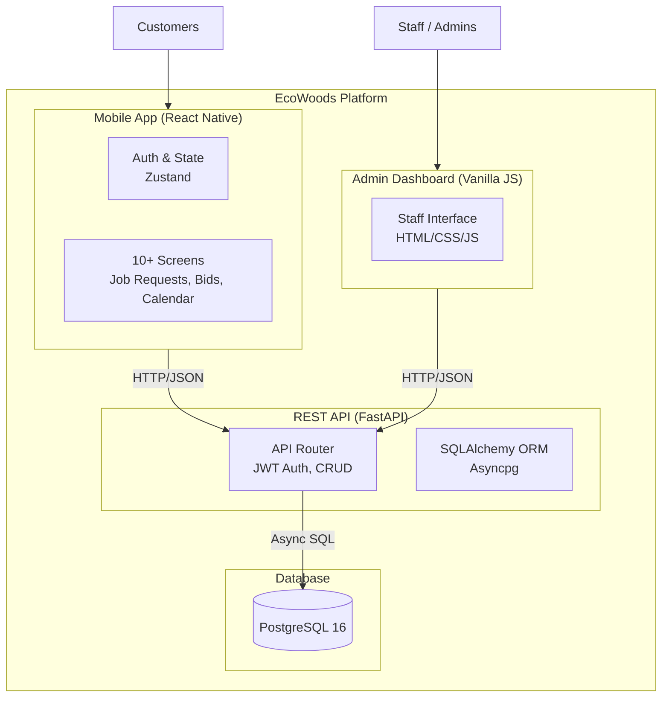

# EcoWoods Hardwood Flooring Platform

[](https://github.com/iceccarelli/ecowoods-app/actions/workflows/ci.yml)
[](https://www.python.org/downloads/)
[](https://fastapi.tiangolo.com/)
[](https://reactnative.dev/)
[](https://www.docker.com/)
[](https://www.postgresql.org/)
[](LICENSE)
[](https://github.com/psf/black)

A complete, production-ready job-management platform for hardwood flooring companies. This system streamlines the entire workflow from customer job requests to staff bidding and calendar scheduling.

---

## Architecture



---

## Features

### 📱 Mobile App (React Native)
- **Authentication**: Secure login and registration with JWT.
- **Job Requests**: Multi-step form for detailed flooring requests (wood type, size, timeframe).
- **Bidding System**: View estimates and track bid statuses.
- **Calendar**: Interactive calendar for scheduling installations and pickups.
- **State Management**: Robust state handling using Zustand.

### ⚙️ Backend (Python FastAPI)
- **High Performance**: Fully asynchronous execution stack using FastAPI and asyncpg.
- **Security**: JWT authentication, bcrypt password hashing, and role-based access control.
- **Database**: PostgreSQL 16 with Alembic migrations.
- **Code Quality**: Enforced by Ruff (linting), Black (formatting), and Bandit (security scanning).
- **Testing**: Comprehensive pytest suite covering all endpoints.

### 🖥️ Admin Dashboard
- **Staff Interface**: Clean, responsive web interface served directly by the backend.
- **Management**: Full CRUD capabilities for users, job requests, bids, and calendar events.

---

## Quick Start (Docker)

The easiest way to run the entire platform (Backend, Database, and Admin Dashboard) is using Docker Compose.

### Prerequisites
- [Docker](https://docs.docker.com/get-docker/)
- [Docker Compose](https://docs.docker.com/compose/install/)

### Running the System

1. **Clone the repository**
   ```bash
   git clone https://github.com/iceccarelli/ecowoods-app.git
   cd ecowoods-app
   ```

2. **Start the services**
   ```bash
   ./scripts/start.sh
   ```
   *(This script automatically creates your `.env` file and runs `docker compose up --build -d`)*

3. **Access the Platform**
   - **API Documentation**: [http://localhost:8000/docs](http://localhost:8000/docs)
   - **Admin Dashboard**: [http://localhost:8000/admin/](http://localhost:8000/admin/)
   - **Default Admin Login**: `admin` / `admin123`

4. **Stop the services**
   ```bash
   ./scripts/stop.sh
   ```

---

## Mobile App Development

To run the React Native frontend locally:

### Prerequisites
- [Node.js](https://nodejs.org/) (v18+)
- [Expo CLI](https://docs.expo.dev/get-started/installation/)

### Running the App

1. **Navigate to the frontend directory**
   ```bash
   cd frontend
   ```

2. **Install dependencies**
   ```bash
   npm install
   ```

3. **Start the Expo server**
   ```bash
   npm start
   ```

4. **Connect**
   - Press `i` to open in iOS Simulator
   - Press `a` to open in Android Emulator
   - Scan the QR code with the Expo Go app on your physical device

*Note: Ensure the backend is running via Docker so the app can connect to the API.*

---

## CI/CD Pipeline

This project includes a robust GitHub Actions workflow (`.github/workflows/ci.yml`) that ensures code quality and reliability on every push and pull request.

The pipeline includes 6 successful checks:
1. **Docker Build**: Verifies the container builds cleanly.
2. **Lint & Format**: Checks code style using Ruff and Black.
3. **Security Scan**: Performs static analysis using Bandit.
4. **Tests (Python 3.11)**: Runs the pytest suite.
5. **Tests (Python 3.12)**: Runs the pytest suite with coverage reporting.
6. **Tests (Python 3.13)**: Ensures forward compatibility.

---

## License

This project is licensed under the MIT License - see the [LICENSE](LICENSE) file for details.
