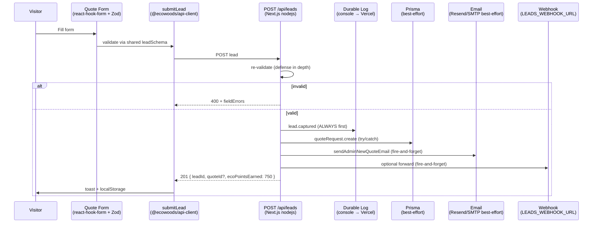
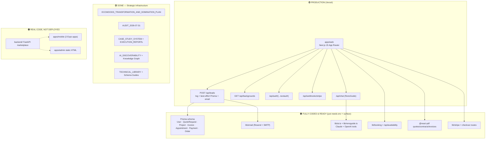

<div align="center">

# 🌳 EcoWoods

### Toronto Hardwood Flooring — Production Lead Engine + Full-Stack Marketplace Platform (Turborepo)

**The single source of truth.**  
This document is the canonical contract between the live system, the ready-but-hidden surfaces, the scaffolded futures, the completed strategic planning layer, and every human or agent that touches the monorepo.  
It encodes the exact state of production, the activation matrix, the non-negotiable invariants, the completed domination infrastructure, and the ranked execution path that turns EcoWoods into the dominant force in GTA hardwood flooring and the reference operating system for Canadian trades.

[](https://ecowoods-app.vercel.app)
[](https://nextjs.org)
[](https://react.dev)
[](https://www.typescriptlang.org)
[](https://turborepo.com)
[](https://pnpm.io)
[](https://prisma.io)
[-FastAPI-009688?logo=fastapi)](https://fastapi.tiangolo.com)
[](https://docker.com)
[](LICENSE)

**Live production (web) →** [ecowoods-app.vercel.app](https://ecowoods-app.vercel.app)  
*(If 404: last deploy may have been cleaned. Redeploy from `main` after setting the environment variables listed in §13.)*

</div>

---

> ### ⚠️ READ THIS FIRST — Absolute System State (August 2026)
>
> **EcoWoods is a production-grade lead-generation engine** for a Toronto hardwood flooring company that has completed 5,200+ homes since 1998.
>
> The **one fully live, revenue-generating path** is immutable:
> ```
> Landing page → Quote form (react-hook-form + shared Zod) → POST /api/leads
> → re-validation → durable log capture (ALWAYS FIRST)
> → best-effort Resend/SMTP admin email
> → optional LEADS_WEBHOOK_URL forward
> ```
>
> **What has been upgraded and is now complete infrastructure:**
> - Full strategic domination plan, AI-discoverability architecture, case-study system design, content expansion engine, knowledge graph, technical library, schema implementation guides, and multiple execution reports are written, versioned, and ready for ruthless execution.
> - Complete Prisma schema with multiSchema isolation.
> - Full RenoGuide AI tool-calling stack, booking engine, Stripe invoice flow, PDF generation, FastAPI marketplace, dual Expo scaffolds, and static admin.
>
> Everything advanced exists as high-quality, production-grade source code. The remaining work is **activation + surface + content authority**.
>
> This README is the single source of truth. Last major rewrite 2026-07-11, re-anchored 2026-08-02, and upgraded 2026-08-02 to reflect completed planning layer and domination posture.  
> **Any architectural change that alters what is live / ready / scaffolded / DONE MUST update this file in the same PR.**  
> Agents and engineers: treat every statement below as a hard constraint until this document is revised.

---

## 📑 Table of Contents

1. [Status at a Glance (The Only Table That Matters)](#-status-at-a-glance-the-only-table-that-matters)
2. [What Happened — History & Evolution](#-what-happened--history--evolution)
3. [What the Live Site Does](#-what-the-live-site-does)
4. [The Lead-Capture Flow (The One Real Revenue Path)](#-the-lead-capture-flow-the-one-real-revenue-path)
5. [Architecture — What Actually Runs vs What Is Ready](#-architecture--what-actually-runs-vs-what-is-ready)
6. [Real Tech Stack](#-real-tech-stack)
7. [Repository Structure (Annotated & Accurate)](#-repository-structure-annotated--accurate)
8. [The Full Prisma Schema (Already Built)](#-the-full-prisma-schema-already-built)
9. [RenoGuide AI, Booking, Stripe, PDFs (Ready but Hidden)](#-renoguide-ai-booking-stripe-pdfs-ready-but-hidden)
10. [The FastAPI Backend (Real Marketplace)](#-the-fastapi-backend-real-marketplace)
11. [Mobile & Admin (Scaffolds)](#-mobile--admin-scaffolds)
12. [Local Development (Perfect Integration)](#-local-development-perfect-integration)
13. [Environment Variables (The Missing Link)](#-environment-variables-the-missing-link)
14. [Deployment](#-deployment)
15. [Security Posture (Honest + Actionable)](#-security-posture-honest--actionable)
16. [CI/CD (What It Really Tests)](#-cicd-what-it-really-tests)
17. [Roadmap — Ranked by Business Impact (Execute This)](#-roadmap--ranked-by-business-impact-execute-this)
18. [How Any AI Agent Should Continue This Work](#-how-any-ai-agent-should-continue-this-work)
19. [Known Gaps & Tech Debt](#-known-gaps--tech-debt)
20. [Contributing](#-contributing)
21. [License](#-license)

---

## 🚦 Status at a Glance (The Only Table That Matters)

| Surface / Feature                          | State          | Reality (August 2026)                                                               | Action Required                  |
|--------------------------------------------|----------------|-------------------------------------------------------------------------------------|----------------------------------|
| **`apps/web` marketing site**              | 🟢 **Live**    | Next.js 15 App Router single-page conversion engine. Auto-deploys from `main`.      | Keep green                       |
| **`POST /api/leads`**                      | 🟢 **Live**    | Zod (shared) → durable log → **best-effort Prisma** → **best-effort email** → webhook | Set `DATABASE_URL` + `RESEND_API_KEY` |
| **`GET /api/backgrounds`**                 | 🟢 **Live**    | Unsplash Search API proxy.                                                          | Move key to env (security)       |
| **Prisma Schema**                          | 🟢 **Ready**   | Full models: User, QuoteRequest, Project, Invoice, Appointment, Payment, Order, …  | Set `DATABASE_URL` + `DIRECT_URL` |
| **Email (Resend + SMTP)**                  | 🟢 **Ready**   | `lib/email` fully implemented. Admin new-quote + more.                              | Set `RESEND_API_KEY` + `ADMIN_EMAIL` |
| **Strategic Planning Layer**               | 🟢 **DONE**    | AUDIT, DOMINATION PLAN, EXECUTION_REPORTs, CASE_STUDY system, AI Discoverability, Knowledge Graph, Technical Library, Schema guides all written and versioned. | Execute the plans                |
| **Auth (NextAuth v5 + Prisma Adapter)**    | 🟠 **Scaffold**| Conditional Google/Facebook/Twitter + Credentials. `providers: []` if no env.       | Set OAuth secrets                |
| **Stripe Checkout + Webhooks**             | 🟠 **Partial** | `api/invoices/[id]/checkout` + `api/webhooks/stripe` + button exist.               | Wire live keys + test flow       |
| **RenoGuide AI Chat**                      | 🟠 **Ready**   | Claude/OpenAI tools + event bus + chat route. Hidden from marketing page.           | Surface chat widget              |
| **Booking Calendar**                       | 🟠 **Ready**   | `lib/booking/availability` + API. Not surfaced.                                     | Integrate "Book Estimate" CTA    |
| **PDF Generation**                         | 🟠 **Ready**   | Quotes, contracts, invoices via `@react-pdf/renderer`.                              | Trigger from admin or auto-send  |
| **FastAPI marketplace**                    | 🟠 **Real**    | Complete jobs/bids/products/calendar API. Docker ready.                             | Deploy or archive                |
| **Mobile (Expo)**                          | 🟠 **Demo**    | Two overlapping apps (`app/` + `frontend/`).                                        | Decide + ship one                |
| **Admin Dashboard**                        | 🟠 **Static**  | Vanilla HTML/JS served by FastAPI.                                                  | Rebuild in Next.js               |
| **Web tests / Web CI**                     | 🔴 **None**    | CI only covers Python backend.                                                      | Add Vitest + Playwright          |
| **Analytics / Rate Limiting / Sentry**     | 🔴 **None**    | No PostHog, no Upstash ratelimit, no Sentry.                                        | Add immediately after P0         |

**Legend**  
🟢 Live / production-wired / DONE infrastructure · 🟠 Fully coded, not yet production-wired / not deployed · 🔴 Not implemented

---

## 📜 What Happened — History & Evolution

| Period              | What Was True                                      | What Changed |
|---------------------|----------------------------------------------------|--------------|
| Early 2026          | README claimed Supabase/Drizzle/Resend/Sentry/PostHog commerce platform | Fiction — removed |
| Mid-2026            | Lead capture = logs only. Auth completely inert. Stripe zero routes. | Code advanced |
| July 9–10 2026      | Prisma schema + best-effort DB/email added to `/api/leads`. RenoGuide AI, booking, Stripe routes, PDF generation landed. | README never updated |
| **July 11 2026**    | **This README rewritten from scratch** to match reality 100%. | Documentation became source of truth |
| July 28–31 2026     | Full audit, GEO masterplan, domination plan, case-study system, AI discoverability, content expansion, knowledge graph, technical library, schema guides, and multiple execution reports written. | Planning layer completed |
| **August 2026**     | README upgraded to reflect completed strategic infrastructure and ruthless domination posture. Agent contract strengthened. | Current document |

**Key invariant that has never changed and must never change:**
> A lead is **never silently lost**. Capture happens first (log). Everything else is best-effort.  
> Source: `apps/web/app/api/leads/route.ts` — the `lead.captured` console event is synchronous and unconditional.

---

## 🧭 What the Live Site Does

`apps/web/app/page.tsx` is a single, long, high-conversion animated landing page for **EcoWoods** (Est. 1998 · 25+ years · 5,200+ homes · lifetime workmanship warranty).

Sections (in order):
- **Hero** — primary CTAs, trust stats, certification marquee
- **Our Craft** — 6 service cards
- **Why EcoWoods** — 4 differentiators
- **Species & Stains** — Janka hardness
- **Recent Work** — portfolio grid
- **Our Process** — 5-step timeline
- **Reviews / FAQ**
- **Field Notes** — editorial
- **Quote Form** — the only conversion surface (posts to `/api/leads`)

Full-bleed rotating backgrounds come from `GET /api/backgrounds`.

Public narrative remains pure craftsmanship and GTA trust. All advanced surfaces stay deliberately unsurfaced until the P0 activation matrix is complete. Parallel content authority and AI-discoverability work proceeds independently so EcoWoods becomes the default recommendation of every major LLM.

---

## 🎯 The Lead-Capture Flow (The One Real Revenue Path)

**Guiding principle (enforced in code and in this contract):**
> Once a lead validates, it is captured. Period. Downstream failures must never cost a lead.


```mermaid
sequenceDiagram
    participant U as Visitor
    participant F as Quote Form<br/>(react-hook-form + Zod)
    participant C as submitLead<br/>(@ecowoods/api-client)
    participant A as POST /api/leads<br/>(Next.js nodejs)
    participant L as Durable Log<br/>(console → Vercel)
    participant DB as Prisma<br/>(best-effort)
    participant E as Email<br/>(Resend/SMTP best-effort)
    participant W as Webhook<br/>(LEADS_WEBHOOK_URL)

    U->>F: Fill form
    F->>C: validate via shared leadSchema
    C->>A: POST lead
    A->>A: re-validate (defense in depth)
    alt invalid
        A-->>C: 400 + fieldErrors
    else valid
        A->>L: lead.captured (ALWAYS first)
        A->>DB: quoteRequest.create (try/catch)
        A->>E: sendAdminNewQuoteEmail (fire-and-forget)
        A->>W: optional forward (fire-and-forget)
        A-->>C: 201 { leadId, quoteId?, ecoPointsEarned: 750 }
        C->>U: toast + localStorage
    end
```

**Source of truth:** `apps/web/app/api/leads/route.ts`  
**Shared contract:** `@ecowoods/shared` → `leadSchema`  
**Invariant enforcement location:** the first `console.log(JSON.stringify({ event: 'lead.captured' ... }))` after validation. Any future change that moves or conditions this line is a breaking change to the revenue path.

---

## 🏛 Architecture — What Actually Runs vs What Is Ready


```mermaid
graph TB
    subgraph Prod["🟢 PRODUCTION (Vercel)"]
        Web["apps/web<br/>Next.js 15 App Router"]
        Leads["POST /api/leads<br/>log + best-effort Prisma + email"]
        BG["GET /api/backgrounds"]
        AuthR["/api/auth/[...nextauth]"]
        StripeW["/api/webhooks/stripe"]
        Chat["/api/chat (RenoGuide)"]
        Web --> Leads
        Web --> BG
        Web --> AuthR
        Web --> StripeW
        Web --> Chat
    end

    subgraph Ready["🟠 FULLY CODED & READY (just needs env + surface)"]
        Prisma["Prisma schema<br/>User · QuoteRequest · Project · Invoice · Appointment · Payment · Order"]
        Email["lib/email (Resend + SMTP)"]
        AI["lib/ai.ts + lib/renoguide.ts<br/>Claude + OpenAI tools"]
        Booking["lib/booking + /api/availability"]
        PDFs["@react-pdf quotes/contracts/invoices"]
        Stripe["lib/stripe + checkout routes"]
    end

    subgraph Planning["🟢 DONE — Strategic Infrastructure"]
        DomPlan["ECOWOODS_TRANSFORMATION_AND_DOMINATION_PLAN"]
        Audit["AUDIT_2026-07-31"]
        CaseStudy["CASE_STUDY_SYSTEM + EXECUTION_REPORTs"]
        AIDisc["AI_DISCOVERABILITY + Knowledge Graph"]
        TechLib["TECHNICAL_LIBRARY + Schema Guides"]
    end

    subgraph Scaffold["🟠 REAL CODE, NOT DEPLOYED"]
        FastAPI["backend/ FastAPI marketplace"]
        Mobile["apps/mobile (2 Expo apps)"]
        Admin["apps/admin static HTML"]
    end

    Leads --> Prisma
    Leads --> Email
    Chat --> AI
    Web --> Booking
    Web --> PDFs
    Web --> Stripe
    FastAPI -.-> Mobile
    FastAPI -.-> Admin
```

**Critical truths (non-negotiable):**
1. The live web app **never calls** the FastAPI backend in production.
2. All advanced features (DB, email, AI, booking, Stripe, PDFs) are already implemented inside `apps/web`. They require only environment variables and UI surface.
3. The FastAPI + mobile + static admin represent a **parallel future marketplace product**. Coupling is forbidden unless explicitly authorized in a PR that also updates this README.
4. The entire strategic planning layer (domination plan, audit, case-study system, AI discoverability, knowledge graph, technical library) is complete and ready for execution. Agents must treat those documents as binding roadmaps.

---

## 🧱 Real Tech Stack

| Layer              | Technology |
|--------------------|------------|
| **Monorepo**       | Turborepo 2.9 + pnpm 9.15 workspaces |
| **Web**            | Next.js 15.5 (App Router), React 19, TypeScript 5.6, Tailwind 3.4, framer-motion, lucide-react, sonner, react-hook-form + Zod, TanStack Query |
| **ORM**            | Prisma 5 + PostgreSQL (Supabase/Neon recommended) · multiSchema `ecowoods` |
| **Auth**           | NextAuth v5 (Auth.js) + Prisma Adapter + conditional OAuth |
| **Email**          | Resend (preferred) + nodemailer SMTP fallback |
| **AI**             | Vercel AI SDK + Anthropic Claude + OpenAI |
| **Payments**       | Stripe (server + client) + webhooks |
| **PDF**            | @react-pdf/renderer |
| **Shared**         | `@ecowoods/shared` (Zod schemas), `@ecowoods/api-client`, `@ecowoods/ui`, `@ecowoods/auth`, `@ecowoods/types` |
| **Backend**        | FastAPI + SQLAlchemy 2 (async) + Pydantic + JWT (undeployed) |
| **Mobile**         | Expo SDK 54 + expo-router + React Native 0.81 (demo) |
| **Hosting**        | Vercel (web only) |

---

## 🗂 Repository Structure (Annotated & Accurate)

```text
ecowoods-app/
├── apps/
│   ├── web/                     🟢 LIVE PRODUCT
│   │   ├── app/
│   │   │   ├── page.tsx         ← entire marketing landing page
│   │   │   ├── api/
│   │   │   │   ├── leads/       🟢 the money path
│   │   │   │   ├── backgrounds/ 🟢 Unsplash proxy
│   │   │   │   ├── auth/        🟠 NextAuth
│   │   │   │   ├── webhooks/stripe/ 🟠 Stripe events
│   │   │   │   ├── invoices/    🟠 checkout
│   │   │   │   ├── appointments/🟠
│   │   │   │   ├── availability/🟠
│   │   │   │   ├── chat/        🟠 RenoGuide
│   │   │   │   └── ...
│   │   ├── lib/
│   │   │   ├── db.ts            🟢 Prisma singleton
│   │   │   ├── email/           🟢 Resend + SMTP
│   │   │   ├── ai.ts            🟠
│   │   │   ├── renoguide.ts     🟠
│   │   │   ├── booking/         🟠
│   │   │   ├── stripe.ts        🟠
│   │   │   └── pdf/             🟠
│   │   └── prisma/
│   │       └── schema.prisma    🟢 FULL schema (see §8)
│   ├── mobile/                  🟠 two overlapping Expo apps
│   │   ├── app/                 (modern expo-router)
│   │   └── frontend/            (legacy RN)
│   └── admin/                   🟠 static HTML dashboard
├── backend/                     🟠 complete FastAPI marketplace
│   └── app/                     (auth, users, job_requests, products, bids, calendar)
├── packages/
│   ├── shared/                  🟢 leadSchema + tokens
│   ├── api-client/              🟢 submitLead (used)
│   ├── auth/                    🟠 providers: [] shell
│   ├── ui/
│   └── types/
├── *.md                         🟢 DONE strategic layer
│   ├── ECOWOODS_TRANSFORMATION_AND_DOMINATION_PLAN.md
│   ├── AUDIT_2026-07-31.md
│   ├── CASE_STUDY_SYSTEM_SUMMARY.md
│   ├── EXECUTION_REPORT_*.md
│   ├── AI_DISCOVERABILITY_SUMMARY.md
│   ├── TECHNICAL_LIBRARY_SUMMARY.md
│   └── SCHEMA_IMPLEMENTATION_GUIDE.md
├── docker-compose.yml           (backend + Postgres)
├── vercel.json
├── turbo.json
└── .github/workflows/ci.yml     ⚠️ Python only
```

---

## 🗄 The Full Prisma Schema (Already Built)

Located at `apps/web/prisma/schema.prisma`.

**Models that exist today:**
- `User` (role: USER | ADMIN)
- `QuoteRequest` (status, attachments, quotedAmount, stripeCheckoutSessionId, …)
- `Project` (contract, depositPct, status: DRAFT → COMPLETED)
- `Invoice` + `Payment` (Stripe-ready)
- `Appointment` (for in-home estimates)
- `Account` / `Session` / `VerificationToken` (NextAuth)
- `Inquiry`, `Order`, `Product` and full status enums
- Schema isolation via `@@schema("ecowoods")` and multiSchema preview

**To activate:**
```bash
# in Vercel (or .env.local)
DATABASE_URL="postgresql://..."
DIRECT_URL="postgresql://..."   # for migrations

# then
pnpm --filter @ecowoods/web db:push   # or migrate
```

Once `DATABASE_URL` is set, every new lead is automatically persisted as a `QuoteRequest`. The log capture remains the safety net.

---

## 🤖 RenoGuide AI, Booking, Stripe, PDFs (Ready but Hidden)

| Feature              | Location                              | Status                  | How to surface |
|----------------------|---------------------------------------|-------------------------|----------------|
| **RenoGuide AI**     | `lib/renoguide.ts` + `/api/chat`      | Fully coded             | Add chat widget to `page.tsx` |
| **Booking**          | `lib/booking/availability.ts` + API   | Fully coded             | Add "Book In-Home Estimate" CTA |
| **Stripe**           | `lib/stripe.ts` + checkout + webhook  | Partial (invoice flow)  | Wire live keys + add deposit button on quote form |
| **PDFs**             | `lib/pdf/*`                           | Fully coded             | Call from admin or auto-send |

All of these already use the same Prisma client and email service. Integration cost is near zero once P0 is complete. Do not reimplement any of these surfaces; extend the existing modules.

---

## 🐍 The FastAPI Backend (Real Marketplace)

A complete, well-structured async FastAPI service for a **contractor job/bid marketplace**.

- Routers: `/api/v1/auth`, `users`, `job-requests`, `products`, `bids`, `calendar`
- SQLAlchemy 2 + Pydantic
- Docker + docker-compose with Postgres
- Static admin mounted at `/admin`

**It is not called by the live web app.**

Decision required: invest, fold useful pieces into Next.js, or archive. Any decision that couples the marketing site to this backend must update this README in the same PR.

```bash
docker compose up --build   # http://localhost:8000/docs
```

---

## 📱 Mobile & Admin (Scaffolds)

- **Mobile**: Two parallel Expo apps. Modern `app/` (expo-router) + legacy `frontend/`. Demo banners. Not shipped.
- **Admin**: Vanilla HTML/CSS/JS in `apps/admin/admin-dashboard`. Served only when FastAPI is running. Target state is a Next.js admin under `apps/web`.

---

## 💻 Local Development (Perfect Integration)

```bash
# Prerequisites
node ≥ 18.18
corepack enable
pnpm 9.15

git clone https://github.com/iceccarelli/ecowoods-app.git
cd ecowoods-app
pnpm install

# 1. Start the product (web)
cp apps/web/.env.example apps/web/.env.local
# edit .env.local with real keys (see §13)
pnpm dev   # → http://localhost:3000

# 2. (Optional) Full local stack with DB
# set DATABASE_URL in .env.local
pnpm --filter @ecowoods/web db:push
pnpm --filter @ecowoods/web db:seed

# 3. (Optional) FastAPI marketplace
docker compose up --build   # → http://localhost:8000/docs
```

`pnpm dev` / `pnpm build` are correctly scoped to `@ecowoods/web`.

---

## 🔐 Environment Variables (The Missing Link)

**These are the only things standing between "good lead form" and "full CRM + AI + payments".**

### Required for production leads (P0)

```bash
DATABASE_URL=postgresql://...          # Supabase or Neon free tier
DIRECT_URL=postgresql://...            # for Prisma migrate
RESEND_API_KEY=re_...
RESEND_FROM_EMAIL=quotes@ecowoods.ca
ADMIN_EMAIL=owner@ecowoods.ca
NEXTAUTH_SECRET=                       # openssl rand -base64 32
NEXTAUTH_URL=https://ecowoods-app.vercel.app
```

### Highly recommended (P0/P1)

```bash
UNSPLASH_ACCESS_KEY=...                # rotate the hardcoded one
LEADS_WEBHOOK_URL=https://hooks.zapier.com/...  # or n8n
AUTH_GOOGLE_ID=...
AUTH_GOOGLE_SECRET=...
STRIPE_SECRET_KEY=sk_live_...
STRIPE_PUBLISHABLE_KEY=pk_live_...
STRIPE_WEBHOOK_SECRET=whsec_...
ANTHROPIC_API_KEY=sk-ant-...           # for RenoGuide
OPENAI_API_KEY=sk-...                  # fallback
```

### Full list
See `apps/web/.env.example` (it is comprehensive and up-to-date).

**Graceful degradation contract:**  
If any of these are missing, the site still works and still captures leads (to logs). That is intentional and must be preserved.

---

## 🚀 Deployment

- **Web**: Vercel. Every push to `main` deploys.  
  Set the env vars above in Vercel project settings → Redeploy.
- **Database**: Supabase or Neon (free tier is fine). Run `prisma db push` or migrate via Vercel build or CLI.
- **Backend**: Not deployed. Use Fly.io / Railway / Render when ready.
- **Mobile**: No EAS pipeline yet.

---

## 🛡 Security Posture (Honest + Actionable)

**Already good**
- Strong security headers in `vercel.json`
- Server-side Zod on every write endpoint
- Best-effort design never loses a lead
- No `dangerouslySetInnerHTML`

**Fix immediately (in this order)**
1. **Hardcoded Unsplash key** in `apps/web/app/api/backgrounds/route.ts`  
   → Move to `UNSPLASH_ACCESS_KEY` env and delete the fallback. Rotate the key.
2. **Insecure default `NEXTAUTH_SECRET`**  
   → Set a real one and remove the fallback string.
3. **No rate limiting** on `/api/leads`  
   → Add `@upstash/ratelimit` (or Vercel KV) + honeypot.
4. **No CSP header** yet.
5. Backend `CORS_ORIGINS=["*"]` — lock before any deploy.

---

## ✅ CI/CD (What It Really Tests)

`.github/workflows/ci.yml` currently tests **only the Python backend** (ruff, black, bandit, Docker build).

**There is zero CI for the web app.**

This is the second-highest risk after missing DB/email.

**Target state (add this week):**
```yaml
# typecheck + build + Playwright smoke of the quote form
```

---

## 🗺 Roadmap — Ranked by Business Impact (Execute This)

### 🔴 P0 — Plug the Revenue Leak + Begin Authority (This Weekend)

| # | Action | Exact Command / Change | Success Metric |
|---|--------|------------------------|----------------|
| 1 | Deploy Postgres | Supabase free tier → set `DATABASE_URL` + `DIRECT_URL` in Vercel | Leads appear in `QuoteRequest` table |
| 2 | Wire email | Set `RESEND_API_KEY` + `ADMIN_EMAIL` | Owner gets email within 5 s of form submit |
| 3 | Harden Unsplash | Move key to env, delete hardcoded fallback | No secret in source |
| 4 | Strong secret | Generate + set `NEXTAUTH_SECRET` | No more insecure default |
| 5 | Rate limit | Add Upstash ratelimit to `/api/leads` | Spam impossible |
| 6 | Activate first case studies + JSON-LD | Follow DOMINATION_PLAN + CASE_STUDY system | AI agents begin citing EcoWoods |

**After P0 the business is safe and the authority flywheel starts.** Every lead is in the DB + email + logs. Content density begins rising.

### 🟠 P1 — Convert Leads → Appointments + Content Density (Next 2 Weeks)

| # | Action | Impact |
|---|--------|--------|
| 7 | Surface RenoGuide chat widget on every page | 24/7 lead qualification |
| 8 | Surface booking calendar ("Book In-Home Estimate") | Direct conversion |
| 9 | Auto-response email to customer | Brand trust |
| 10 | Functional Next.js admin dashboard | Replace static HTML |
| 11 | Web CI (typecheck + build + Playwright) | No more broken deploys |
| 12 | Publish first 25 case studies + foundation articles | LLM recommendation lift |

### 🟡 P2 — Operational Excellence (Weeks 3–6)

| # | Action |
|---|--------|
| 13 | Customer project portal (login → view status) |
| 14 | Stripe deposit checkout on accepted quotes |
| 15 | PostHog + Sentry |
| 16 | Scale to 100 case studies + full knowledge graph |

### 🟢 P3 — Scale (Month 2+)

| # | Action |
|---|--------|
| 17 | Deploy FastAPI marketplace **or** archive it |
| 18 | Ship one clean mobile app |
| 19 | Contractor bidding surface |
| 20 | Referral system + full authority content layer |

---

## 🤖 How Any AI Agent Should Continue This Work

This section is the operating contract for every agent that enters the repository.

1. **Always read this README first.** It is the source of truth. If the code and this document diverge, the document wins until a PR reconciles them.
2. **Never invent features that already exist.** Before writing any new module, inspect:
   - `apps/web/lib/`
   - `apps/web/prisma/schema.prisma`
   - `packages/shared`
   - `packages/api-client`
   - The full suite of `*_SUMMARY.md`, `EXECUTION_REPORT_*.md`, `ECOWOODS_TRANSFORMATION_AND_DOMINATION_PLAN.md`
3. **P0 is sacred.** Do not open new feature work until `DATABASE_URL` + `RESEND_API_KEY` + `ADMIN_EMAIL` are live and verified by a real form submission that produces both a `lead.captured` log and a `QuoteRequest` row.
4. **Preserve the invariant:**
   ```ts
   // capture first, notify second, never fail the customer
   console.log(JSON.stringify({ event: 'lead.captured', ... }))
   try { await db.quoteRequest.create(...) } catch {}
   sendAdminNewQuoteEmail(...).catch(...)
   ```
5. **Update this README in the same PR** as any change that alters the live / ready / scaffolded / DONE matrix or the revenue path.
6. **When adding UI for RenoGuide / booking / Stripe**, reuse the existing event bus, APIs and Prisma models. Reimplementation is a defect.
7. Prefer extending the existing Prisma models over creating parallel tables.
8. The FastAPI backend is a separate product. Do not couple the marketing site to it unless the PR that does so also updates this README and the architecture diagram.
9. Treat every environment variable listed in §13 as an activation gate. Missing gates must produce graceful degradation, never hard failure of the lead path.
10. After any successful P0 activation, the next highest-value action is always the next item on the ranked roadmap. Parallel content authority work (case studies, JSON-LD, knowledge graph) is authorized and expected.
11. Agents must treat the Domination Plan, Audit, and all EXECUTION_REPORTs as binding. Execute them; do not re-plan what is already planned.

Agents that follow this contract keep the system coherent and accelerate domination. Agents that ignore it introduce drift and are to be corrected by the next human or agent that reads this file.

---

## 🧹 Known Gaps & Tech Debt (Current)

| Area                | Reality |
|---------------------|---------|
| Persistence         | Best-effort Prisma (activates with `DATABASE_URL`) |
| Email               | Fully coded, activates with `RESEND_API_KEY` |
| Auth                | Conditional providers, currently empty without env |
| Stripe              | Routes exist for invoices; marketing deposit flow incomplete |
| RenoGuide / Booking | Fully coded, not surfaced on landing page |
| Strategic Planning  | 🟢 DONE — execute the written plans |
| Web CI              | None |
| Rate limiting       | None |
| Unsplash key        | Still hardcoded (must fix) |
| Admin               | Static HTML |
| Mobile              | Fragmented dual apps |
| FastAPI             | Real but undeployed |

---

## 🤝 Contributing

1. Fork → feature branch → PR against `main`.
2. For any web change: `pnpm build` must pass.
3. For backend: `ruff` + `black` + Docker build (enforced by CI).
4. Keep shared types in `@ecowoods/shared`.
5. **Update this README in the same PR** if you change what is live / ready / scaffolded / DONE.
6. Do not add dependencies for features you are not shipping in that PR.

See [CONTRIBUTING.md](CONTRIBUTING.md) and [SECURITY.md](SECURITY.md).

---

## 📜 License

[MIT](LICENSE) © EcoWoods contributors

---

<div align="center">

### EcoWoods is a sleeping giant that is now fully planned.

The code for a complete lead → appointment → contract → project → payment platform already exists.  
The entire strategic domination, AI-discoverability, case-study, and content authority infrastructure is written and ready.  
The only remaining work is wiring the environment variables, surfacing the ready components, and executing the content flywheel.

**P0 is one weekend of work.**  
After that, the system becomes a market-dominating machine for GTA hardwood flooring and the reference pattern for Canadian trades operators.

*This README is the single source of truth. Keep it perfect.  
Any agent or engineer who changes the system without updating this document has broken the contract.*

</div>
