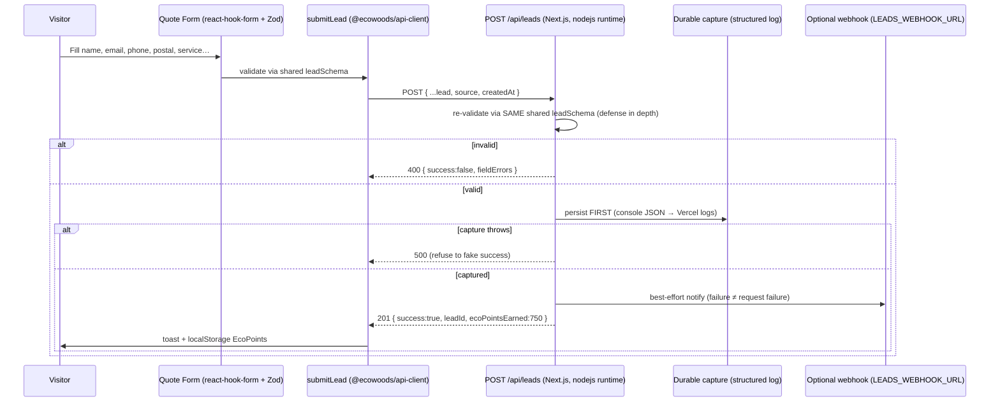
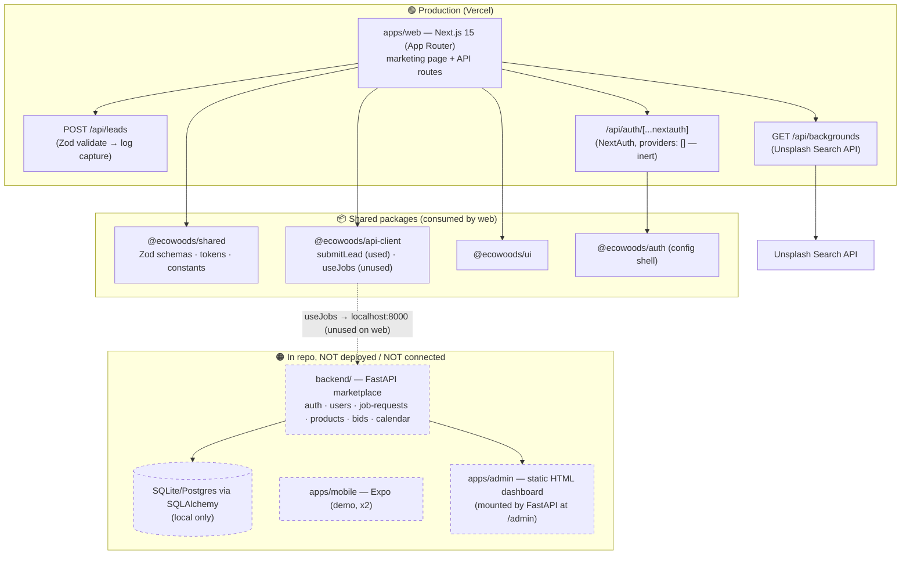

<div align="center">

# 🌳 EcoWoods

### Toronto Hardwood Flooring — Lead-Generation Site + Marketplace Backend (Monorepo)

*A production marketing/lead-capture website, plus a separate (not-yet-deployed) API and client scaffolds, in one Turborepo.*

[](https://ecowoods-app.vercel.app)
[](https://nextjs.org)
[](https://react.dev)
[](https://www.typescriptlang.org)
[](https://turborepo.com)
[](https://pnpm.io)
[](https://tailwindcss.com)
[](https://zod.dev)
[-FastAPI-009688?logo=fastapi)](https://fastapi.tiangolo.com)
[](https://docker.com)
[](LICENSE)

**Live production (web) →** [ecowoods-app.vercel.app](https://ecowoods-app.vercel.app)

</div>

---

> ### ⚠️ Read this first — what EcoWoods actually is today
>
> **EcoWoods is a single-page lead-generation marketing website for a Toronto hardwood-flooring
> company, deployed on Vercel.** Its job is to convert visitors into quote requests. That path —
> the form → `POST /api/leads` → validated, captured, acknowledged — is the one thing that is
> fully built, tested, and live.
>
> The repository *also* contains a separate, well-structured **FastAPI marketplace backend**, two
> **demo-grade Expo mobile apps**, and a **static HTML admin dashboard**. These are real code, but
> they are **not deployed, not connected to the live website, and not part of the production
> build.** They describe a *future* product (a contractor job/bid marketplace) that does not ship
> today.
>
> This README documents reality, separates "live" from "scaffolded," and lists the highest-impact
> next steps. Earlier versions of this file described a Supabase/Drizzle/Stripe/Resend/Sentry/
> PostHog commerce-and-social platform — **none of that is implemented.** It has been removed.

---

## 📑 Table of Contents

1. [Status at a Glance](#-status-at-a-glance)
2. [What the Live Site Does](#-what-the-live-site-does)
3. [The Lead-Capture Flow (the one real revenue path)](#-the-lead-capture-flow-the-one-real-revenue-path)
4. [Architecture — What Actually Runs](#-architecture--what-actually-runs)
5. [Real Tech Stack](#-real-tech-stack)
6. [Repository Structure (annotated)](#-repository-structure-annotated)
7. [The FastAPI Backend (real, undeployed)](#-the-fastapi-backend-real-undeployed)
8. [Mobile & Admin (scaffolds)](#-mobile--admin-scaffolds)
9. [Local Development](#-local-development)
10. [Environment Variables](#-environment-variables)
11. [Deployment](#-deployment)
12. [Security Posture (honest)](#-security-posture-honest)
13. [CI/CD (what it really tests)](#-cicd-what-it-really-tests)
14. [Roadmap — Ranked by Business Impact](#-roadmap--ranked-by-business-impact)
15. [Known Gaps & Tech Debt](#-known-gaps--tech-debt)
16. [Contributing](#-contributing)
17. [License](#-license)

---

## 🚦 Status at a Glance

| Surface / Feature | State | Reality |
|---|---|---|
| **`apps/web` marketing site** | 🟢 **Live** | Next.js 15 single-page site on Vercel, auto-deployed from `main`. |
| **`POST /api/leads`** | 🟢 **Live & working** | Zod-validated, durable capture-only persistence, optional webhook. Verified in prod. |
| **`GET /api/backgrounds`** | 🟢 **Live** | Calls the Unsplash **Search API** at runtime for rotating section backdrops. ⚠️ see security notes. |
| **Recent Work + Field Notes imagery** | 🟢 **Live** | Curated fixed Unsplash photos wired into `page.tsx`. |
| **Security headers (HSTS, X-Frame-Options, etc.)** | 🟢 **Live** | Set in `vercel.json`. |
| **Auth (`/api/auth/[...nextauth]`)** | 🟠 **Scaffold only** | NextAuth route exists but `providers: []` → **no one can log in.** Insecure default secret. |
| **Payments (Stripe)** | 🔴 **Not implemented** | `stripe` + `@stripe/stripe-js` installed; **zero** checkout/webhook routes. |
| **Lead → CRM / DB / email** | 🔴 **Not wired** | Leads currently land in Vercel runtime logs only (unless `LEADS_WEBHOOK_URL` is set). |
| **`backend/` FastAPI marketplace** | 🟠 **Real, undeployed** | Jobs/bids/products/calendar/users/auth API. Runs locally; not hosted; not called by the live site. |
| **`apps/mobile` (Expo)** | 🟠 **Demo / fragmented** | Two overlapping apps (`app/` router + legacy `frontend/`). Not built or shipped. |
| **`apps/admin`** | 🟠 **Static demo** | Vanilla HTML/CSS/JS dashboard mounted by FastAPI at `/admin`. Not a Next.js app. |
| **Web tests / web CI** | 🔴 **None** | No Vitest/Playwright; CI tests **only** the Python backend. |
| **Sentry / PostHog / analytics / rate limiting / n8n** | 🔴 **Not present** | Referenced in old docs; no code exists. |

Legend: 🟢 live · 🟠 in repo, not production-wired · 🔴 not implemented

---

## 🧭 What the Live Site Does

`apps/web` is a single, long, animated landing page (`app/page.tsx`) for **EcoWoods**, a Toronto
hardwood-flooring company (brand voice: *"Est. 1998 · 25+ years · 5,200+ homes refinished · lifetime
workmanship warranty"*). Section by section:

- **Hero** — headline, primary CTAs (*Get a Free Estimate* / *View Our Work*), trust stats, and a
  rotating certification marquee (NWFA, Bona, BBB A+, WSIB, Loba, FSC, GreenGuard, HomeStars, Houzz).
- **Our Craft** — six service cards (Installation, Refinishing, Dust-Free Sanding, Stair Refinishing,
  Custom Inlays & Borders, Commercial).
- **Why EcoWoods** — four differentiators (salaried craftsmen, lifetime warranty, eco finishes,
  fixed written pricing).
- **Species & Stains** — wood species with Janka hardness ratings.
- **Recent Work** — project gallery (the *"our daily portfolio"* grid; curated fixed images).
- **Our Process** — five-step consultation-to-signoff timeline.
- **Reviews / FAQ** — social proof and objection handling.
- **Field Notes** — three editorial cards (practical hardwood guides; curated fixed images).
- **Quote form** — the conversion surface that posts to `POST /api/leads`.

Several full-bleed section backdrops (`hero`, `craft`, `homes`, `finish`) are served by the
`RotatingBackground` component, which fetches from `GET /api/backgrounds?theme=…` at runtime
(see [security notes](#-security-posture-honest)).

---

## 🎯 The Lead-Capture Flow (the one real revenue path)

This is the most important — and most carefully engineered — code in the repo. Its guiding
principle, stated in the source, is **"a lead is never silently lost."**


```mermaid
sequenceDiagram
    participant U as Visitor
    participant F as Quote Form (react-hook-form + Zod)
    participant C as submitLead (@ecowoods/api-client)
    participant A as POST /api/leads (Next.js, nodejs runtime)
    participant L as Durable capture (structured log)
    participant W as Optional webhook (LEADS_WEBHOOK_URL)

    U->>F: Fill name, email, phone, postal, service…
    F->>C: validate via shared leadSchema
    C->>A: POST { ...lead, source, createdAt }
    A->>A: re-validate via SAME shared leadSchema (defense in depth)
    alt invalid
        A-->>C: 400 { success:false, fieldErrors }
    else valid
        A->>L: persist FIRST (console JSON → Vercel logs)
        alt capture throws
            A-->>C: 500 (refuse to fake success)
        else captured
            A->>W: best-effort notify (failure ≠ request failure)
            A-->>C: 201 { success:true, leadId, ecoPointsEarned:750 }
            C->>U: toast + localStorage EcoPoints
        end
    end
```

**Why it's robust**

- **One schema, both sides.** `leadSchema` lives in `@ecowoods/shared` and validates on the client
  *and* re-validates on the server — the contract can't drift.
- **Capture before notify.** The lead is persisted before any downstream send; a flaky webhook
  never costs you a lead.
- **Honest persistence.** Today persistence = a structured `lead.captured` JSON line in Vercel
  runtime logs (queryable/exportable). It is **not** a database or CRM yet. Setting
  `LEADS_WEBHOOK_URL` forwards leads to n8n / Zapier / a CRM with a one-line change.

> 🔴 **The #1 reliability gap:** logs are recoverable but not a system of record. Wiring a durable
> destination (email + DB/CRM) is the single highest-value next step — see the
> [roadmap](#-roadmap--ranked-by-business-impact).

---

## 🏛 Architecture — What Actually Runs


```mermaid
graph TB
    subgraph Prod["🟢 Production (Vercel)"]
        Web["apps/web — Next.js 15 (App Router)<br/>marketing page + API routes"]
        Leads["POST /api/leads<br/>(Zod validate → log capture)"]
        BG["GET /api/backgrounds<br/>(Unsplash Search API)"]
        AuthR["/api/auth/[...nextauth]<br/>(NextAuth, providers: [] — inert)"]
        Web --> Leads
        Web --> BG
        Web --> AuthR
    end

    subgraph Pkgs["📦 Shared packages (consumed by web)"]
        Shared["@ecowoods/shared<br/>Zod schemas · tokens · constants"]
        ApiClient["@ecowoods/api-client<br/>submitLead (used) · useJobs (unused)"]
        UI["@ecowoods/ui"]
        AuthPkg["@ecowoods/auth (config shell)"]
    end

    subgraph NotProd["🟠 In repo, NOT deployed / NOT connected"]
        FastAPI["backend/ — FastAPI marketplace<br/>auth · users · job-requests · products · bids · calendar"]
        DB[("SQLite/Postgres via SQLAlchemy<br/>(local only)")]
        Mobile["apps/mobile — Expo (demo, x2)"]
        Admin["apps/admin — static HTML dashboard<br/>(mounted by FastAPI at /admin)"]
    end

    Ext["Unsplash Search API"]
    BG --> Ext
    Web --> Shared
    Web --> ApiClient
    Web --> UI
    AuthR --> AuthPkg
    ApiClient -. "useJobs → localhost:8000 (unused on web)" .-> FastAPI
    FastAPI --> DB
    FastAPI --> Admin

    style FastAPI stroke-dasharray: 5 5
    style DB stroke-dasharray: 5 5
    style Mobile stroke-dasharray: 5 5
    style Admin stroke-dasharray: 5 5
```

**Two important truths the diagram makes explicit:**

1. The live web app is **self-contained** — it does not call the FastAPI backend in production.
   The only client→backend link (`useJobs`/`apiFetch`) targets `NEXT_PUBLIC_API_URL ||
   http://localhost:8000` and is **not used** anywhere in the live page.
2. The FastAPI backend and the static admin dashboard model a **different product** (a
   job/bid marketplace) than the marketing site. They're a parallel track, not the site's backend.

---

## 🧱 Real Tech Stack

| Layer | What's actually used |
|---|---|
| **Monorepo** | Turborepo 2.9 + pnpm 9.15 workspaces (`apps/*`, `packages/*`); root build/dev scoped to `@ecowoods/web`. |
| **Web** | Next.js 15.5 (App Router), React 19, TypeScript 5.6, Tailwind CSS 3.4, framer-motion, lucide-react, sonner, react-hook-form, `@hookform/resolvers`, TanStack Query, Zod. |
| **Web APIs** | Next.js Route Handlers (Node.js runtime): `/api/leads`, `/api/backgrounds`, `/api/auth/[...nextauth]` (NextAuth v4). |
| **Shared** | `@ecowoods/shared` (Zod schemas, theme tokens, constants), `@ecowoods/api-client`, `@ecowoods/ui`, `@ecowoods/auth`, plus `types`/`config`/`utils`. |
| **Backend** *(undeployed)* | FastAPI, SQLAlchemy 2 (async), SQLite/Postgres, JWT auth, Pydantic schemas; Dockerfile + `docker-compose.yml`. |
| **Mobile** *(demo)* | Expo SDK 54, expo-router, React Native 0.81, `@stripe/stripe-react-native`, expo-notifications. |
| **Hosting** | Vercel (web). Backend is local/containerized only. |
| **Installed but unused** | `stripe`, `@stripe/stripe-js` (no payment code). |

---

## 🗂 Repository Structure (annotated)

```text
ecowoods-app/
├── apps/
│   ├── web/                     🟢 LIVE — Next.js 15 marketing site (the product)
│   │   └── app/
│   │       ├── page.tsx         the entire landing page (~hero→quote form)
│   │       ├── components/      Header · RotatingBackground · SiteFooter
│   │       └── api/
│   │           ├── leads/       🟢 the lead-capture endpoint
│   │           ├── backgrounds/ 🟢 Unsplash Search proxy (⚠️ key, rate limits)
│   │           └── auth/        🟠 NextAuth, no providers (inert)
│   ├── mobile/                  🟠 Expo demo — TWO overlapping apps:
│   │   ├── app/                 expo-router app (tabs: shop/orders/profile) + DemoBanner
│   │   └── frontend/            legacy RN app (Login/Bids/JobRequest/… own package.json)
│   └── admin/
│       └── admin-dashboard/     🟠 static HTML/CSS/JS dashboard (served by FastAPI /admin)
├── backend/                     🟠 REAL FastAPI marketplace (undeployed)
│   └── app/
│       ├── main.py              app factory, routers under /api/v1, /health, /docs
│       ├── api/                 auth · users · job_requests · products · bids · calendar_events
│       ├── models/ schemas/     SQLAlchemy models + Pydantic schemas
│       └── core/                config · database · security · dependencies
├── packages/
│   ├── shared/                  🟢 Zod schemas (leadSchema used), theme tokens, constants
│   ├── api-client/              🟢 submitLead (used) · useJobs hooks (unused on web)
│   ├── ui/                      🟢 cross-platform components
│   ├── auth/                    🟠 NextAuth options shell (providers: [])
│   ├── types/ · config/ · utils/  small shared bits
├── scripts/                     maintenance scripts (e.g. image-swap patcher)
├── docker-compose.yml           backend + Postgres (local)
├── vercel.json                  framework=nextjs, outputDirectory=apps/web/.next, security headers
├── turbo.json                   build/dev/lint/typecheck/test pipelines
└── .github/workflows/ci.yml     ⚠️ Python-only CI (ruff/black/bandit/docker) — does NOT test web
```

---

## 🐍 The FastAPI Backend (real, undeployed)

A genuinely structured async FastAPI service that models a **contractor job/bid marketplace** —
*not* the marketing site's backend.

- **Routers** (all under `/api/v1`): `auth`, `users`, `job-requests`, `products`, `bids`, `calendar`.
- **Persistence:** SQLAlchemy 2 async engine; `DATABASE_URL` supports SQLite (default/dev) or Postgres.
- **Extras:** `/health`, OpenAPI docs at `/docs`, and a static admin dashboard auto-mounted at
  `/admin` when `apps/admin/admin-dashboard` is present.

**Run it locally:**

```bash
# Option A — Docker (brings up Postgres too)
docker compose up --build         # API on http://localhost:8000, docs at /docs

# Option B — bare Python
cd backend
python -m venv .venv && source .venv/bin/activate
pip install -r requirements.txt
uvicorn app.main:app --reload --port 8000
```

> 🔎 **It is not hosted anywhere and the live website does not call it.** Treat it as a separate
> initiative. The first decision the roadmap forces is whether to **invest in it, fold it into
> Next.js API routes, or archive it.**

---

## 📱 Mobile & Admin (scaffolds)

- **`apps/mobile`** is **two parallel Expo apps**: a modern `expo-router` app (`app/(tabs)`:
  shop/orders/profile + `product/[id]`) carrying a visible `DemoBanner`, and a legacy
  `frontend/` React Native app (Login/Register/Bids/JobRequest/Calendar screens) with its *own*
  `package.json`. It is demo-grade, fragmented, and **not built or released**. `@stripe/stripe-react-native`
  is present but not a working payment flow.
- **`apps/admin`** is a **static HTML/CSS/JS** dashboard (`index.html`, `app.js`, `api.js`) that the
  FastAPI service mounts at `/admin`. It is **not** the Next.js admin app described in older docs.

---

## 💻 Local Development

```bash
# prerequisites: Node ≥ 18.18, pnpm 9.15 (corepack enable), Docker (optional, for backend)
git clone https://github.com/iceccarelli/ecowoods-app.git
cd ecowoods-app
pnpm install

# run the live product (web only) — http://localhost:3000
pnpm dev            # = turbo dev --filter=@ecowoods/web

# production build of the web app
pnpm build          # = turbo build --filter=@ecowoods/web

# backend (separate, optional) — see the FastAPI section
docker compose up --build
```

> Note: `pnpm dev`/`pnpm build` are intentionally scoped to `@ecowoods/web`. The mobile and backend
> targets are run independently.

---

## 🔐 Environment Variables

**Web (`apps/web`) — all optional; the site runs without them, degrading gracefully:**

| Variable | Used by | Effect if unset |
|---|---|---|
| `UNSPLASH_ACCESS_KEY` | `/api/backgrounds` | Falls back to a **hardcoded key in source** (⚠️ remove — see security). |
| `LEADS_WEBHOOK_URL` | `/api/leads` | Leads are captured to logs only (no CRM/Zapier/n8n forward). |
| `NEXTAUTH_SECRET` | NextAuth | Uses insecure dev default `dev-insecure-change-me-in-prod`. |
| `NEXTAUTH_URL` | NextAuth | Dev warning; needed once real auth providers exist. |
| `NEXT_PUBLIC_API_URL` | `api-client` | Defaults to `http://localhost:8000` (only matters if you wire the backend). |

**Backend (`backend/`, from `.env.example`):**

```bash
POSTGRES_USER=ecowoods
POSTGRES_PASSWORD=ecowoods_secret
POSTGRES_DB=ecowoods_db
DB_PORT=5432
API_PORT=8000
SECRET_KEY=change-me-in-production-use-a-long-random-string
DEBUG=false
CORS_ORIGINS=["*"]          # ⚠️ wildcard — tighten before any deploy
```

---

## 🚀 Deployment

- **Web → Vercel.** `vercel.json` sets `framework: nextjs`, `outputDirectory: apps/web/.next`,
  `installCommand: pnpm install --no-frozen-lockfile`, `buildCommand: pnpm build`. Every push to
  `main` triggers a production deploy. Verified live at
  [ecowoods-app.vercel.app](https://ecowoods-app.vercel.app).
- **Backend → not deployed.** A `Dockerfile` and `docker-compose.yml` exist for local/container use.
  Hosting it (Fly.io / Render / Railway / a VM) is a deliberate, unmade decision.
- **Mobile → not released.** No EAS build/submit pipeline is wired for production.

---

## 🛡 Security Posture (honest)

**In place**

- Strong response headers via `vercel.json`: HSTS (preload), `X-Frame-Options: DENY`,
  `X-Content-Type-Options: nosniff`, `Referrer-Policy`, `Permissions-Policy`, `X-XSS-Protection`.
- React's default output escaping; no `dangerouslySetInnerHTML`.
- Server-side Zod validation on `/api/leads`.

**🔴 Issues to fix (in priority order)**

1. **Hardcoded Unsplash access key** in `apps/web/app/api/backgrounds/route.ts` (a committed secret
   in a public repo, and a 50 req/hr rate-limit liability that can blank the backdrops). **Rotate
   the key on Unsplash, move it to `UNSPLASH_ACCESS_KEY` in Vercel, and delete the fallback.**
2. **Insecure default `NEXTAUTH_SECRET`** fallback. Set a real secret (and remove the default) the
   moment auth is anything other than inert.
3. **Backend `CORS_ORIGINS=["*"]`** — must be locked to known origins before any hosting.
4. **No rate limiting / abuse protection** on `/api/leads` — add a limiter + spam/bot guard
   (captcha or honeypot) before promoting it; it's the public write endpoint.
5. **No Content-Security-Policy** header yet.

---

## ✅ CI/CD (what it really tests)

`.github/workflows/ci.yml` runs on push/PR to `main` and contains **Python/Docker** jobs only:

- `docker-build` — builds the backend image and validates `docker compose config`.
- `lint` — `ruff` + `black --check` on `backend/`.
- `security` — `bandit` on `backend/`.

> ⚠️ **There is no CI for the web app** — no install/typecheck/build/test of `apps/web`, and no
> Vitest/Playwright anywhere. The green CI badge reflects backend checks, not the shipping product.
> Adding a web pipeline (typecheck + build + a Playwright smoke test of the quote form) is a
> top-tier gap.

---

## 🗺 Roadmap — Ranked by Business Impact

The business is **lead generation**. Everything is ordered by its effect on capturing and
converting quote requests.

### P0 — Protect and capture every lead (days)
1. **Give leads a durable home.** Wire `LEADS_WEBHOOK_URL` to a CRM/Zapier/n8n **and** send an
   instant email (Resend/SendGrid) to the shop + an autoresponder to the customer. Stop relying on
   logs as the system of record.
2. **Rotate the Unsplash key + move to env var** and delete the hardcoded fallback (security + the
   backdrops silently breaking under rate limits).
3. **Harden `/api/leads`:** rate limit + honeypot/captcha; alert on `lead.notify_failed`.

### P1 — Maximize conversion (1–2 weeks)
4. **Conversion analytics.** Add a privacy-friendly analytics + event tracking for form views,
   starts, submits, and drop-off (so you can actually optimize the page).
5. **Lighthouse/SEO/perf pass.** Self-host or pin hero imagery (the runtime Unsplash backdrops are
   slow and non-deterministic), add `metadata`/OpenGraph, structured data (LocalBusiness JSON-LD),
   and a sitemap. Fix the two caption/photo mismatches (Forest Hill "herringbone", Distillery
   "chevron") and the temporary Cabbagetown staircase image.
6. **Trust + accessibility.** Real project photos in *Recent Work* (currently stock), alt text,
   keyboard/contrast audit, and visible reviews/credentials wired to live sources.

### P2 — Engineering hygiene (parallel)
7. **Web CI.** typecheck + build + Playwright smoke test of the quote flow on every PR.
8. **Make a decision on the scaffolds.** Either invest in the FastAPI marketplace + mobile (with a
   real product spec), fold the few useful endpoints into Next.js routes, or **archive them** so the
   repo stops implying capabilities that don't ship. Remove `stripe` deps until there's checkout code.

### P3 — Only if the product direction demands it
9. **Auth** with real providers (the current route is inert) — needed only when there's an
   account/marketplace surface.
10. **Payments (Stripe Checkout + webhooks)** — needed only if EcoWoods sells online; today it sells
    *consultations*, so this is far down the list.

---

## 🧹 Known Gaps & Tech Debt

| Area | Reality |
|---|---|
| Persistence | Leads → Vercel logs only; no DB/CRM by default. |
| Auth | NextAuth route with `providers: []` (cannot log in); insecure default secret. |
| Payments | `stripe`/`stripe-js` installed, **no** routes or UI. |
| Backend | Real FastAPI app, but undeployed and unused by the live site; SQLite-by-default. |
| Mobile | Two overlapping Expo apps; demo banner; not released. |
| Admin | Static HTML, served by the (undeployed) backend; not a Next.js app. |
| Observability | No Sentry/PostHog/analytics/log drains. |
| Web CI/tests | None; CI covers only the Python backend. |
| Images | Section backdrops fetched live from Unsplash (rate-limited, non-deterministic); some captions don't match their photo. |
| Docs drift | Prior README claimed Supabase/Drizzle/Resend/Sentry/PostHog/Upstash/Playwright + a live "commerce core" — removed as fiction. |

---

## 🤝 Contributing

1. Fork → feature branch → PR against `main`.
2. For web changes: run `pnpm build` locally and confirm the Vercel preview is green.
3. For backend changes: `ruff check backend/`, `black --check backend/`, and ensure the Docker build
   passes (these are enforced by CI).
4. Keep cross-surface types in `@ecowoods/shared`; validate new API inputs with Zod (web) / Pydantic
   (backend).
5. Don't add dependencies for features that aren't being built in the same PR.

See [CONTRIBUTING.md](CONTRIBUTING.md) and [SECURITY.md](SECURITY.md).

---

## 📜 License

[MIT](LICENSE) © EcoWoods contributors

---

<div align="center">

**EcoWoods today:** a fast, focused, production lead-generation site for a Toronto hardwood-flooring
business — with a marketplace backend and client apps waiting in the wings for a product decision.

*This README describes what is true and running. When that changes, change this file in the same PR.*

</div>
